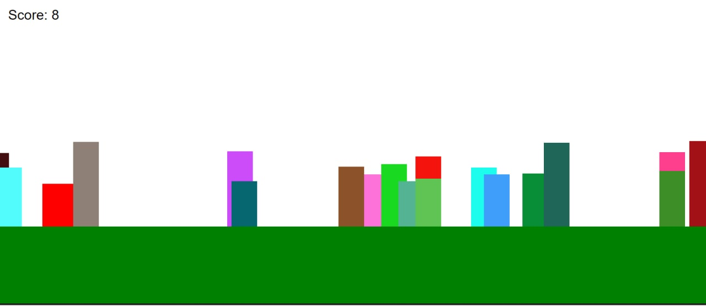

# Jump Game Web JS

A web-based game designed by Javascript is a jumping game where you can jump by pressing the key or touching the screen and many obstacles will come for you.

This game supports both **Phones** and **Desktops** as well.

**Demo:** https://basemax.github.io/JumpGameWebJS/

### TODO

- Playing sound by javascript

Source of the idea: https://www.youtube.com/watch?v=a0TyCnFgqlk
